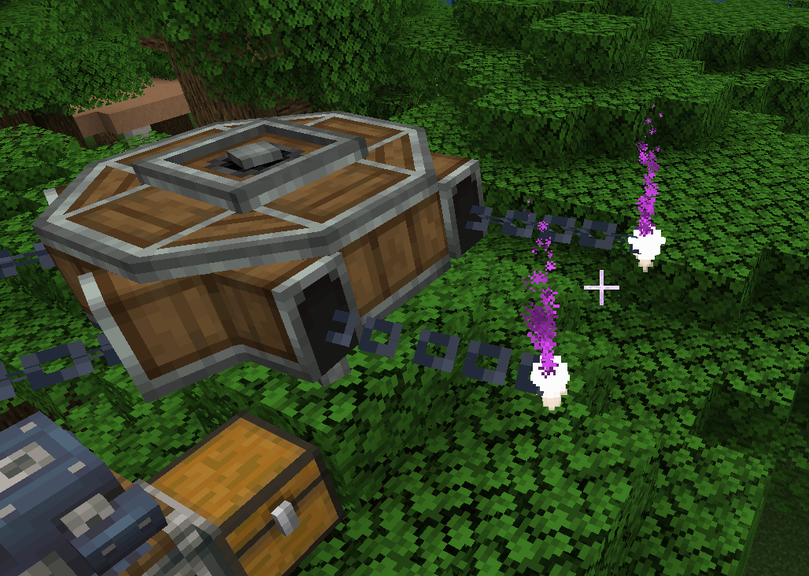
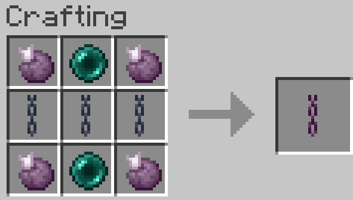
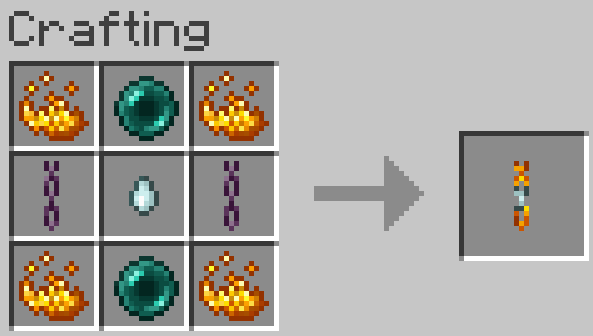

# Create: Teleport Chain Conveyor

**Create: Teleport Chain Conveyor** is a lightweight addon for **Create** (NeoForge) that enables instant, long-distance, and cross-dimensional package transport across chain conveyor networks without endless physical chains or chunkloading headaches.

## Download on [CurseForge](https://www.curseforge.com/minecraft/mc-mods/create-teleportation-chain-conveyor)

## Why You Need It

In vanilla Create logistics, setting up long-distance or cross-dimensional conveyor networks presents several challenges:
* **Massive Resource Costs**: Linking distant factory hubs requires placing hundreds or thousands of physical chain blocks.
* **Dimensional Barriers**: Chain conveyors cannot natively cross dimensions.
* **Unloaded Chunk Disruption**: Packages traversing long unrendered distances can stall or desync.
* **Aeronautics Compatibility**: This mod is compatible with the Create Aeronautics mod. You can connect chain networks on you vehicle with your base.

**Create: Teleport Chain Conveyor** solves these problems seamlessly. By linking conveyor hubs with teleport chains, you create point-to-point portals that instantly teleport packages, synchronize rotational kinetic power, and pause safely if destination chunks are unloaded.

## How to Use

1. **Link**: Right-click a **Chain Conveyor** with a Teleportation Chain or Interdimensional Chain in hand.
2. **Connect**: Right-click a second **Chain Conveyor** anywhere in the world (or in another dimension with an Interdimensional Chain) to establish the link.
3. **Clear Link**: Place a linked chain into any crafting grid by itself to clear its stored coordinates.
4. **Dismantle**: Sneak (`Shift`) + Click a chain connection stub with any **Wrench** to sever the link and refund the chain item. (Breaking the conveyor block also refunds all connected chains).

## Crafting

### Teleportation Chain
*For long-distance connections within the same dimension.*

| Input | Output |
| :--- | :--- |
| 4× Chorus Fruit + 2× Ender Pearl + 3× Chain | 1× **Teleportation Chain** |

---

### Interdimensional Chain
*For cross-dimensional connections (Overworld ↔ Nether ↔ End).*

| Input | Output |
| :--- | :--- |
| 4× Blaze Powder + 2× Ender Pearl + 1× Ghast Tear + 2× Teleportation Chain | 1× **Interdimensional Chain** |

## Requirements

* **Minecraft**: `1.21.1`
* **Mod Loader**: [NeoForge](https://neoforged.net/) (`21.1.233` or newer)
* **Dependency**: [Create](https://www.curseforge.com/minecraft/mc-mods/create) (`6.0.11` or newer)
* **Java**: `Java 21`

## License
This project is licensed under the **MIT License**. See [LICENSE](LICENSE) for details.

## Contributing
Contributions and feedback are welcome! Feel free to open issues or pull requests.

